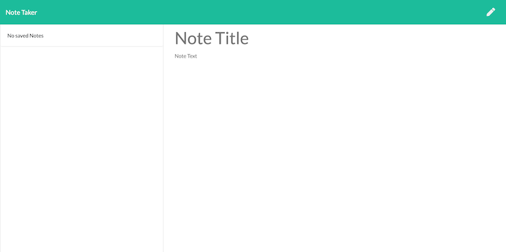
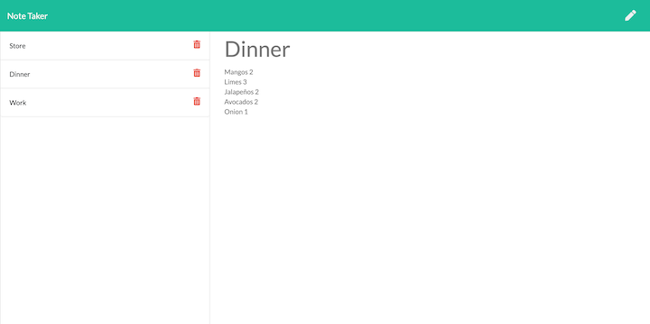

# 11 Express.js: Note Taker

# Description 
An application that can be used to write, save and delete notes.  This application used an express backend to save and retrieve note data from a JSON file. 
# Table of Contents

1. [Description](#Description)
2. [Features](#Features)
3. [License](#License)
4. [Contributing](#Contributing)
5. [Questions](#Questions)
6. [Usage](#Usage)
7. [Badges](#Badges)

## Features
- JSON
- Express.js
- Node.js
- NPM i
- localhost

# License

## This application is covered by the MIT license. 

# Contributing
Contributions are excepted. Fill free to fork. 

# Questions
## GitHub User name 
jmnfire
### Link to GitHub:
https://github.com/jmnfire
### To access the website
https://github.com/jmnfire/11-Express.js--Note-Taker
### Email address 
jovan.m.nixon@gmail.com
## Heroku 
https://dashboard.heroku.com/apps/rocky-ocean-10109

# Usage

# Badges

